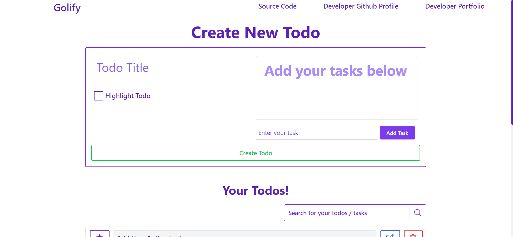
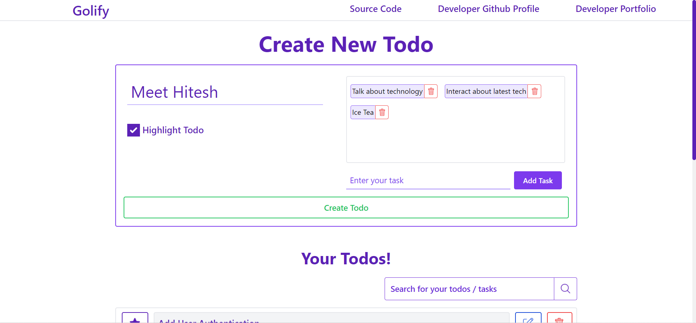
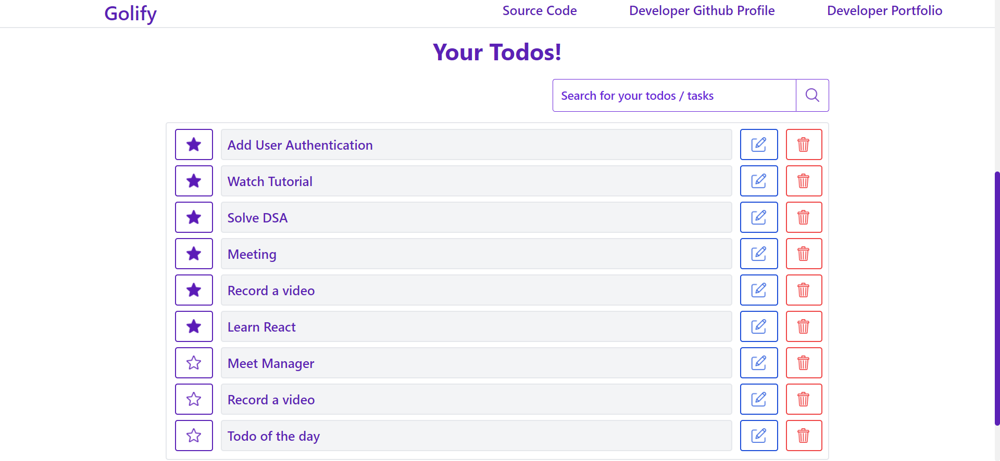
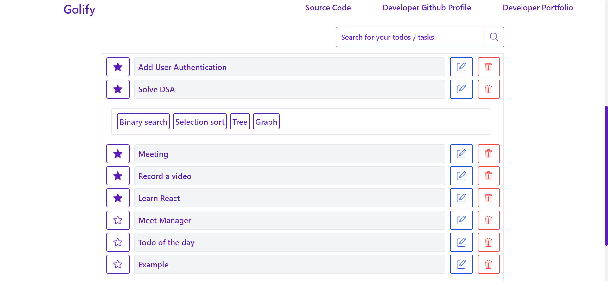
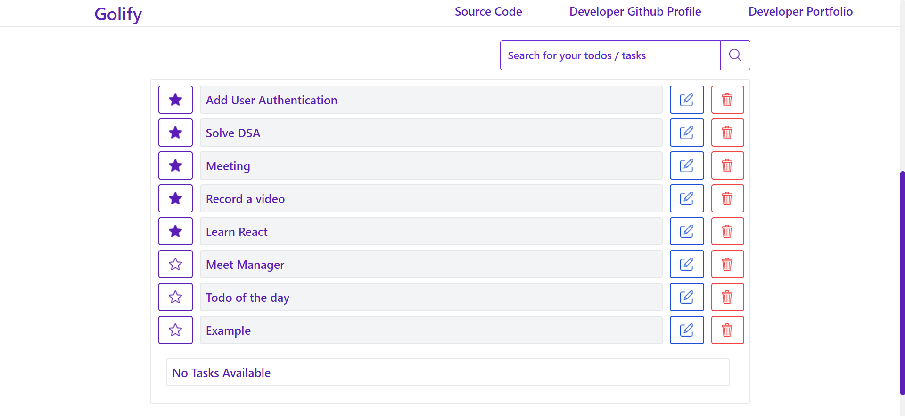

#  Golify - Achieve your goals of the day

Golify is a todo application built using following technologies **_Mongo DB_**, **_Expresss JS_**, **_React JS_**, **_Node JS_**, **_Tailwind CSS_**. 

Users using the application can explain the todo in more descriptive way with the help of tasks. User can prioritize (highlight) the todo. This application provides the CRUD operations on todo.

 : **USER AUTHENTICATION, SORTING FEATURE, TODO TIMESTAMPS**

### Icons for the project was taken from flaticons
### 💟 Shout out to wonderfull icons creators [freepik](https://www.flaticon.com/authors/freepik), [pixel-perfect](https://www.flaticon.com/authors/pixel-perfect), [kiranshastry](https://www.flaticon.com/authors/kiranshastry), [Catalin Fertu](https://www.flaticon.com/authors/catalin-fertu) 💟
### 💟 Shout out to wonderfull mentor [Hitesh Choudhary](https://www.instagram.com/hiteshchoudharyofficial/), Anurag 💟

## 👨‍💻 About Developer 👨‍💻

Hey I am Aarya. Fullstack Javascript Developer from silicon city of India (aka IT Hub, Greencity). Very much eager to explore and develop scalable, user friendly, robust applications. I also take up couple of bootcamps on web development. 

[LinkedIn](https://www.linkedin.com/in/aarya512)  
[Aarya](https://aaryadev.netlify.app)  
[Instagram](https://www.instagram.com/aarya_5122/)

Do reach out and provide your valuable insights about the project. I appreciate your inputs.

Do reach out if you have any project idea let's work together and achieve goals.

## ▶️ YOUTUBE: [Run in your localhost server](https://youtu.be/a7xcoLRlwTs) ▶️

## 👨‍✈️ Architecture of project (Project Planning) 👨‍✈️

## 😃 Features of golify 😃

- Create Todo
- Update Todo
- View Todo
- Delete Todo
- Describe Steps of Action
- Search Todo
- Responsiveness
- User Authentication
- Sorting Todos
- Todo Timestamp

- User Authentication
- Sorting Todos
- Timestamp on todos 

## 🎯 Machine requirements to run this project 🎯

- Node JS (runtime environment)
- Mongo DB Compass

## 🪜 Steps to run the project in your machine 🪜

- Download the project locally
- Unzip the folder
- Open the unzipped folder in vscode
- Click on backend folder
- Rename public.env to .env
- Ppen the .env file
- Provide value to PORT variable (My suggestion: 4000)
- Provide value tp MONGODB_URL variable (My suggestion: mongodb://localhost:27017/golify)
- Open new terminal to run server
- Run command 1: cd backend (If your terminal is not in this directory)
- Run command 2: npm install
- Run command 3: npm start
- Now open frontend folder
- If you have entered different value for PORT variable in backend folder > .env file, Update package.json file in frontend folder.
    - Open package.json look for proxy update :4000 value in the proxy value to the value you provided in .env
    - For example: 
        - Port=5000 (.env file backend folder)
        - proxy:"https://localhost:5000" (package.json file frontend folder)
- Open a new terminal to run frontend
- Run command 1: cd frontend (If your terminal is not in this directory)
- Run command 2: npm install
- Run command 3: npm start

If your webpage doesn't load hit this url in your browser: http://localhost:300

### 🎉 Here you go your application is up and running... 🎉

## ❤️ Glimpse of project ❤️

### Web View 🖥️

### Mobile view 📱

## ⏳ Meta Information ⏳

- Time taken: 7 days
- Upcoming Future Enhancement: User Authentication

## 😄 Thanks for spending your valuable time on this project 😄
